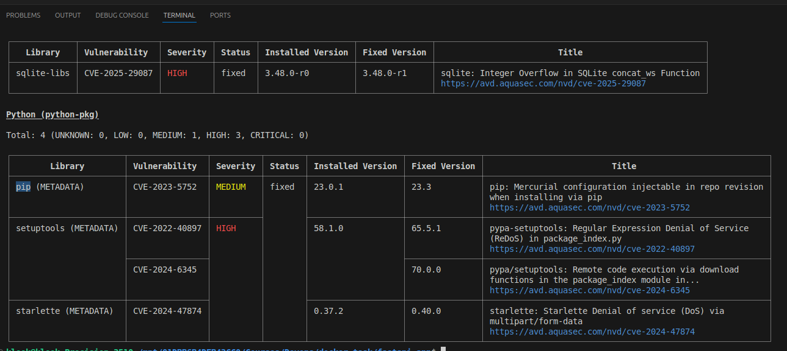
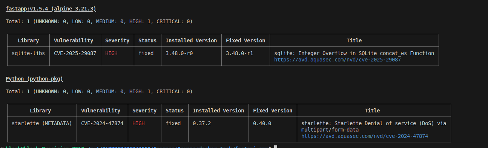
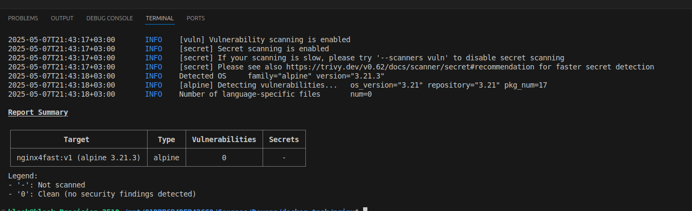
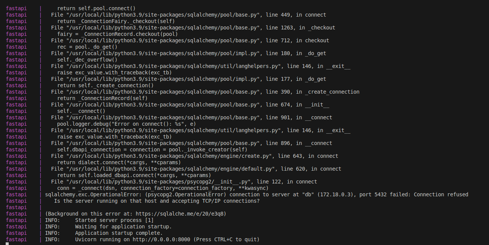
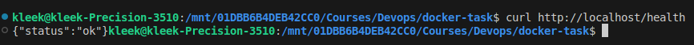
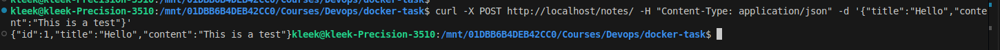
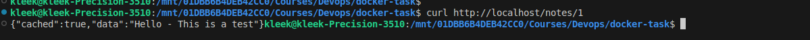
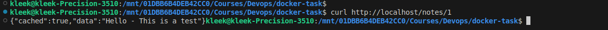

# scored_task_docker

This is a docker compose file that builds a fastapi application with postgre as database, redis as cache directory, and nginx as reverse proxy web server.

## file structure
/fastapi_app\
│  ├── app/ \
│  │    └── main.py\
│  ├── requirements.txt\
│  ├── Dockerfile\
│  └── docker-compose.yml\
│\
└── nginx/\
     └── nginx.conf


## FastAPI app
This app is designed to take notes from user, save it in database sequentially, and print them out using the database id 
It's written with python and using FastAPI for the backend communications 
its container is built on on the python alpine image for smaller size and quicker deployment

## NGINX as reverse proxy 
All web traffic is managed by NGINX to listen to requests and redirect them to the suitable instance
It's built on an alpine image with NGINX added and configuration file with suitable path inside the image itself

## PostgreSQL database
The database that holds all the notes taken in the app.

## Redis cache
The cached database is a quicker link to the app itself, quicker response from the app in as long as the container is running, as it's deleted after shutdown 

## Docker images justification 
### 1- Python FastAPI app
The app is built on the python alpine image to minimize vulnerability, increase deployment speed, and increase reliability 

### 2- NGINX
Instead of using the official nginx alpine image, i started with an alpine base image which then NGINX was installed onto with the needed paths and configuration file
The image is <10MB in size versus the offical 28MB image

### 3- Postgre DB
Using the bitnami image the Postgre image is smaller than the official image -105MB vs 155MB- and no vulnerabilities

### 4- Redis
The official redis alpine had no vulnerablities and was lightweight so it didn't need any alteration 

## Security check

### 1-FastAPI app
after initial image build this was the security scan



after some fixes this is the latest security scan



### 2-NGINX
The scan showed no vulnerabilities so no fixes were needed




## Running app
Using command

```bash
docker-compose build\
docker-compose up\
```

the containers should output as follow



### Health check


```bash
curl http://localhost/health
```


output:\



### Entering data 


```bash
curl -X POST http://localhost/notes/ -H "Content-Type: application/json" -d '{"title":"Hello","content":"This is a test"}'
```

output:\


### Reading data


```bash
curl http://localhost/notes/1
```

output:\


### Cache 
after stopping the container and running it again we run this command\

```bash
curl http://localhost/notes/1\
```


which will output the previously written data found in the redis cache




## Docker compose file

```yaml
version: '3.8'

services:
  fastapi:
    build: ./fastapi-app
    container_name: fastapi
    restart: always
    ports:
      - "8000:8000"
    environment:
      - REDIS_HOST=redis
    depends_on:
      - redis
      - db

  redis:
    image: redis:6.2-alpine
    restart: always
    ports:
      - "6379:6379"
    volumes:
      - redis_data:/data

  db:
    image: bitnami/postgresql:17.4.0
    restart: always
    ports:
      - "5432:5432"
    environment:
      POSTGRES_USER: postgres
      POSTGRES_PASSWORD: password
      POSTGRES_DB: mydatabase
    volumes:
      - postgres_data:/var/lib/postgresql/data
    
  nginx:
    build: ./nginx
    restart: always
    ports:
      - "80:80"
      - "443:443"
    
    depends_on:
      - fastapi

volumes:
  redis_data:
  postgres_data:
```


## Future improvments
1- fixing remaining FastAPI image vulnerabilities\
2- adding a non-root user to run NGINx\